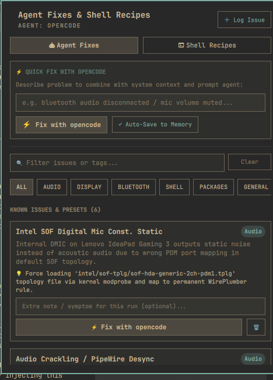
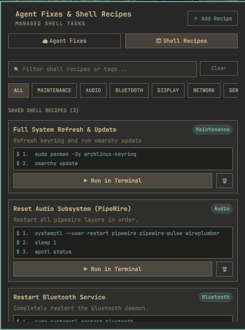

# Omarchy Troubleshooter & Task Recipes (Agent Fixes & Shell Recipes)

A powerful plugin for the Omarchy Linux status bar that works as a centralized hub to log recurring PC issues, trigger auto-fixes via your AI coding agent, and execute structured, multi-step shell command sequences (recipes).

## 🚀 Key Features

### 󱚣 Agent Fixes & Issue Memory
Log recurring system errors, configuration bugs, or glitches alongside their known fixes. Instead of trying to remember complex terminal commands or spending hours troubleshooting the same issue twice, instantly offload the task to your default system AI agent (e.g., OpenCode, Claude, Codex, Gemini).

- **One-Click Issue Auto-Fix:** Click "⚡ Fix with Agent" on a card to automatically combine the system issue context with prompt instructions and open an interactive session with your AI agent.
- **Quick Fix / Instant Context:** Ask the agent to fix a newly encountered issue on the fly using Omarchy's native `omarchy agent prompt` launcher. The agent will inherit all the local troubleshooting context needed to trace the problem.
- **Categorize & Tag:** Sort issues by hardware/software components (Audio, Display, Bluetooth, Pacman, etc.) and search across all logs.



### 󰆍 Shell Task Recipes
Store and repeatedly execute multi-step shell sequences in order. Perfect for maintenance scripts, resetting frozen services, system updates, and automated cleanup tasks.

- **Step-By-Step Terminal Execution:** Review the exact shell commands in a dark preview box. Click "▶ Run in Terminal" to open a floating Omarchy presentation terminal.
- **Controlled Auto-Run:** The terminal displays the recipe context and waits for user confirmation (pressing `[Enter]`) before executing steps sequentially.
- **Visual Feedback:** Each command is clearly echoed with status styling, minimizing confusion and preventing terminal clutter. 



## 🛠️ Installation

1. Clone or download this repository.
2. Symlink the plugin folder directly to your Omarchy user config:
   ```bash
   ln -s /path/to/omarchy-troubleshooter ~/.config/omarchy/plugins/mahan.troubleshooter
   ```
3. Restart your Omarchy shell so it registers the new plugin:
   ```bash
   omarchy restart shell
   ```

*Note: The plugin securely saves issue memory locally at `~/.config/omarchy/troubleshooter-log.json` and recipes at `~/.config/omarchy/troubleshooter-sequences.json`.*

## 📖 Publishing & Marketplace

This plugin fully conforms to Omarchy's QuickShell-based `manifest.json` schema and exposes its primary overlay entrypoint via `Panel.qml`.

> **License:** MIT License
